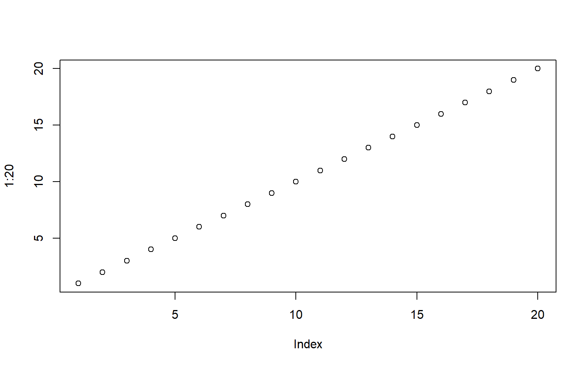

## Row {60%)}

<!-- code in an r script can be referenced with a source command -->

::: {.cell}
::: {.cell-output-display}
{width=768}
:::
:::

## Row {10%}

Nothing to See here folks!!! Just text on a dashboard

### Column

::: {.cell}
::: {.cell-output-display}
{width=768}
:::
:::

<!-- quarto and .rmd files are referred to in this way as shown below -->

## Quarto

Each code chunk and text section get their own card on the dashboard

::: {.cell}
::: {.cell-output-display}
{width=768}
:::
:::

<!-- Because there are 2 hashtags in the .qmd file above, those hashtags are being interpreted as part of the dashboard structure, not like a heading structure for a quarto document

In other words, it evaluates the hashtags in the child .qmd file as if they were here in this file too. That's why this is put on a new row (because the file starts with two hashtags-->

<!-- Note that each block of text and each code chunk will get their own card on the dashboard -->